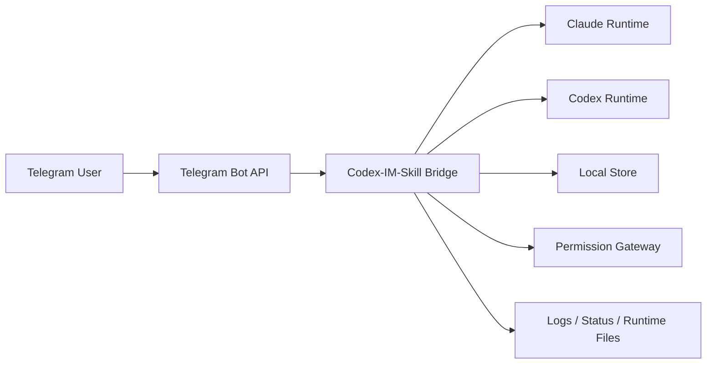

# 我做了一个把 Codex / Claude Code 桥接到 Telegram 的 Skill：Codex-IM-Skill

最近我把自己一直想要的一条工作流做出来了：

**把本地的 Codex / Claude Code 会话桥接到 Telegram。**

也就是说，我在电脑上跑 Codex 或 Claude Code，  
然后可以直接在手机 Telegram 上继续发消息、收回复、看状态、查日志，  
而不是必须一直守在终端前。

项目地址：

- GitHub: https://github.com/xn030523/Codex-IM-Skill

如果一句话概括这个项目，它的定位其实很简单：

> 它不是一个独立 Bot 平台，而是一个把本地 AI 编码工作流延伸到手机端的 Skill。

---

## 我为什么要做这个项目

我自己平时会比较重度地用 Codex / Claude Code。

但一个很现实的问题是：

- 人不可能一直坐在电脑前
- 思路经常是在离开工位的时候冒出来
- 有时候只是想补一句需求
- 有时候只是想看一下桥接服务是不是还活着
- 有时候是想在手机上继续当前上下文，而不是重新开一个新会话

如果每次都要重新回到电脑前，重新找终端，重新接回会话，  
整个流会断得很明显。

所以我做这个项目的目标从一开始就不是“做个聊天机器人”，  
而是想解决一个更具体的问题：

**怎么把本地 AI 编码会话，尽量自然地延续到手机端。**

---

## 这个项目到底是什么

Codex-IM-Skill 本质上是一个 **本地 bridge skill**。

它做的事情不是把模型部署到云上，也不是替代 Codex / Claude Code，  
而是作为一个桥接层，连接下面两端：

- 一端是本地运行的 Codex / Claude Code
- 另一端是 Telegram

中间这层 bridge 负责：

- 读取本地配置
- 启动和维护守护进程
- 接收 Telegram 消息
- 把消息转发给本地运行时
- 把运行结果再回发到 Telegram
- 记录日志、状态、会话和权限交互

所以它的核心不是“聊天 UI”，  
而是 **本地工作流桥接能力**。

---

## 我为什么最后收敛成 Telegram-only

一开始我不是没考虑过做多平台。

像 Discord、飞书、QQ 这种平台，从“功能表”角度看当然更大、更全。  
但我后来越来越确定一件事：

> 对这类工具来说，真正重要的不是“支持的平台数量”，而是“其中一条链能不能做顺”。

多平台一旦铺开，复杂度会瞬间上去：

- 每个平台都有自己的 token 逻辑
- 每个平台都有自己的消息模型
- 每个平台都有自己的鉴权和会话行为
- 文档会膨胀
- setup 会变复杂
- 排障路径会越来越碎

最后很容易变成一种典型状态：

- 看上去支持很多
- 实际上每个平台都不够顺

所以我这次做了一个比较明确的取舍：

- 不追求平台数量
- 先把 Telegram 这条路径打磨顺
- 先把 setup、start、status 这些关键体验打磨顺
- 先让用户能真的装上、跑起来、查得清楚

换句话说，这个项目现在的策略就是：

**先把一条链做扎实，再谈扩展。**

---

## 当前项目能做什么

当前版本的能力大概可以概括为这些：

- 作为 Skill 被识别和安装
- 通过 Telegram 与本地 Codex / Claude Code 会话交互
- 支持 `setup / start / stop / status`
- `setup` 过程中支持自动获取 Telegram `Chat ID`
- `start` 前自动检查并补安装本地 Node 依赖
- 支持 Linux / macOS / Windows
- 支持 `claude` / `codex` / `auto` 三种运行时模式
- 本地持久化存储消息、状态、日志和运行时文件

我这里特别强调一点：

这个项目不是“做一个能回消息的 Telegram Bot”那么简单。

它更重要的部分其实在于：

- 怎么维护本地会话状态
- 怎么处理日志和状态文件
- 怎么桥接权限交互
- 怎么把 Skill 形态做得更自然
- 怎么让安装、启动、排障尽量顺

---

## 整体架构

这个项目不是 Webhook 公网架构，也不是服务端托管模式。

它更接近下面这种结构：



如果拆开看，可以分成几层。

### 1. IM 接入层

当前只保留 Telegram：

- 轮询消息
- 识别聊天来源
- 校验授权
- 把 Telegram 输入转成 bridge 可理解的请求
- 再把结果格式化回 Telegram

### 2. Bridge 协调层

这是整个项目的核心：

- 读取配置
- 初始化上下文
- 绑定 channel 与 session
- 处理生命周期状态
- 调度 provider
- 落盘状态和日志

### 3. Runtime Provider 层

我现在保留了三种运行模式：

- `claude`
- `codex`
- `auto`

这三种模式的目的不是炫技，而是为了适应不同人的本地环境。

有的人只装了 Claude Code。  
有的人只装了 Codex。  
有的人两个都装了，但想让 bridge 自己决定。

### 4. 本地持久化层

所有运行态数据都保存在本地目录：

```bash
~/.codex-skill
```

这里面会有：

- `config.env`
- `logs/bridge.log`
- `runtime/status.json`
- `runtime/bridge.pid`
- `data/*.json`
- `data/messages/*.json`

这套结构我后来也专门收了一轮，  
把之前不合理的旧命名都统一成了 `codex-skill` 体系。

---

## 为什么我把它做成 Skill，而不是普通 Node 工具

这其实是我个人非常在意的一点。

如果只是做一个普通 Node 项目，当然也能跑。  
但那样用户通常要自己理解很多东西：

- 仓库怎么 clone
- 脚本怎么跑
- 配置怎么写
- 出问题去哪看

而 Skill 的价值在于，它能把一个工程项目变成一个“可被 Agent 理解和调用的能力单元”。

也就是说，用户不只是看 README 再自己研究，  
而是可以直接对 Agent 说：

- `codex-skill setup`
- `codex-skill start`
- `codex-skill status`

这会把体验从“我在用一个仓库”变成“我在调用一个能力”。

我觉得未来很多 AI 工具真正的价值，不只是模型本身，  
而是这种围绕工作流的“能力包装层”。

---

## 安装这件事，我中间踩过哪些坑

这个项目有一个我后来感受特别深的点：

> “能安装” 和 “能用” 根本不是一回事。

我现在的仓库已经可以被技能安装器识别。  
例如可以通过类似这样的方式安装：

```bash
npx skills add xn030523/Codex-IM-Skill
```

但早期版本有一个很现实的问题：

- Skill 虽然装上了
- 但本地依赖并不一定已经安装
- 用户一旦直接 `start`
- 就可能在构建或运行阶段失败

实际用户反馈里就真的出现过这种情况：

- 运行目录和日志目录都创建了
- 但启动阶段还是挂了
- 原因不是配置错了
- 而是缺本地 Node 依赖

这类问题对普通用户非常致命，因为他会觉得：

- 明明已经“安装成功”
- 为什么还是不能用

所以后面我做了两件事：

### 1. 把 `dist` 构建产物提交进仓库

这样至少不会要求每个用户都先自己本地 `npm run build`

### 2. 在启动链里补上“自动安装依赖”

现在 `start` 前会先检查：

- `node_modules` 是否存在
- `claude-to-im` 是否存在
- `@anthropic-ai/claude-agent-sdk` 是否存在
- `codex` / `auto` 模式下 `@openai/codex-sdk` 是否存在

如果缺失，就自动执行安装。

也就是说，我现在更希望用户面对的是这种体验：

1. 安装 skill
2. 配置 Telegram
3. 直接 start

而不是：

1. 安装 skill
2. 猜为什么跑不起来
3. 手动补 `npm install`
4. 再猜为什么还不行

---

## 为什么 Telegram 的 `Chat ID` 配置我也专门重做了一轮

我后来发现，普通用户在 Telegram 配置里最容易卡的，不是 token，而是：

- 什么是 `Chat ID`
- 什么是 `Allowed Users`
- 到底应该填哪个
- 去哪里拿

如果这一步让用户自己读一堆 JSON，体验会非常差。

所以我后来把 setup 的默认路径改成了下面这种：

1. 用户提供 Bot Token
2. 用户先给 bot 发一条消息
3. 程序自动拉 `getUpdates`
4. 自动拿到 `chat.id`
5. 自动写入配置

这样用户不用一开始就理解太多平台细节。

我觉得很多项目的问题不在于代码多难，  
而在于作者默认用户也愿意陪你一起理解实现细节。  
实际上大多数用户只在乎：

- 我现在要填什么
- 为什么要填这个
- 填完能不能马上用

这个项目后面我在 setup 这块做的，大部分也是围绕这个原则。

---

## 目录结构和命名，我为什么花时间专门整理

这个项目我后面有一轮非常明确的整理，就是把命名和目录收一遍。

现在的核心结构大概是：

```text
src/
  main.ts
  config.ts
  file-store.ts
  claude-provider.ts
  codex-provider.ts
  permission-gateway.ts
  sse.ts
  logger.ts

scripts/
  daemon.sh
  daemon.ps1
  supervisor-linux.sh
  supervisor-macos.sh
  supervisor-windows.ps1
  telegram-cli.js
  install-codex.sh
  build.js
```

我比较在意这些点：

- 文件名要能反映职责
- 包名、数据目录、服务名、日志前缀要统一
- 文档不要拆得太碎
- setup 路径要收口

因为只要项目准备公开给别人装，  
“看起来可信” 本身就是产品的一部分。

很多东西功能上没问题，  
但命名乱、目录乱、文档散，  
用户第一眼就不信。

---

## 现在这个项目更适合什么人

我觉得它目前比较适合下面这些人：

- 本地长期使用 Codex / Claude Code 的人
- 希望把当前 AI 编码上下文延续到手机的人
- 更喜欢本地 bridge，而不是公网托管 Bot 的人
- 希望通过 Skill 方式管理能力，而不是维护一堆手工脚本的人

不太适合的人也很明确：

- 想做 SaaS 级多租户机器人平台
- 想做复杂 webhook / 回调系统
- 想把它当成企业 IM 中台

这个项目的定位始终是：

**本地开发工作流增强，而不是云端机器人平台。**

---

## 我现在最在意的几个设计点

### 1. 先把一条主路径做顺

不是先堆平台数量，  
而是先把 Telegram 这条路径打磨到：

- 能装
- 能配
- 能起
- 能查

### 2. 不要让用户替我排障

我越来越反感一种项目状态：

- 出问题了
- 用户还得先自己猜
- 再去翻文档
- 再去猜脚本

所以这个项目我比较强调：

- `status`
- `logs`
- `status`
- `lastExitReason`
- 自动装依赖
- 启动前检查

### 3. Skill 不该只是“包装壳”

如果一个 Skill 只是把命令包一层，  
但并没有真正优化安装、配置和排障体验，  
那这个 Skill 其实没有完成它应该完成的价值。

我更希望这个项目不是“名字像 Skill”，  
而是真的在行为上更像一个完整能力模块。

---

## 目前我觉得还不够好的地方

虽然现在主链已经比最开始顺很多了，但我不想把它说得太满。

我自己觉得还可以继续打磨的点，至少有这些：

### 1. 首次安装体验还能再压缩

虽然已经解决了“启动前自动装依赖”，  
但我还是希望未来安装体验更接近：

- 安装
- setup
- start

三步就能结束。

### 2. 运行时依赖还偏重

现在我虽然已经把 `dist` 构建产物入库了，  
但它仍然不是完全自包含的运行形态。

### 3. 消息交互体验还能继续细化

当前主要目标还是“稳定跑通”。  
未来如果继续做，我会想让手机端交互再自然一点。

### 4. 更进一步的极简运行模式

如果未来能继续减少运行时依赖，  
那整个安装和发布体验都会更舒服。

---

## 我后面还想继续做什么

当前我自己的后续想法，大概是这些：

### 1. 继续收安装体验

把首次上手再压缩一点，  
尽量减少用户需要理解的实现细节。

### 2. 继续优化启动链和排障链

包括：

- 更明确的依赖缺失提示
- 更明确的运行时提示
- 更明确的日志引导
- 更明确的错误分类

### 3. 继续优化 Telegram 配置体验

虽然 `Chat ID` 现在已经支持自动探测，  
但我还想把这条路径再做傻瓜一点。

### 4. 视情况再考虑是否扩平台

但前提一定是：

**Telegram 这条主路径足够稳定。**

---

## 我为什么把它发出来

因为我越来越觉得，AI Coding 工具真正缺的，  
不只是更强的模型，而是更顺的工作流桥接层。

很多时候真正影响效率的不是：

- 模型参数多大
- benchmark 分数多高

而是：

- 能不能很快接回上下文
- 能不能在手机上继续当前工作
- 能不能少折腾安装
- 能不能出问题时快速定位

这种桥接层在我看来不是“边角料”，  
反而很接近真实生产力。

所以我把这个项目做成了现在这个形态：

- Telegram-only
- Skill-first
- 本地 bridge
- 强调 setup / start / status 主路径

我不觉得它已经是最终形态，  
但至少我希望它先把一件事做扎实：

**让本地 Codex / Claude Code 会话，真的可以自然延续到手机。**

---

## 项目地址

- GitHub: https://github.com/xn030523/Codex-IM-Skill

如果你本身就在用 Codex / Claude Code，  
又刚好想把本地 AI 编码工作流桥接到 Telegram，  
欢迎试试，也欢迎直接提意见。

我自己现在最关心的反馈主要是这些：

- setup 还有哪里不顺
- `Chat ID` 获取是不是还可以更简单
- `start` 链有没有继续踩坑
- Telegram-only 这个取舍你怎么看
- Skill 安装体验还有哪些地方不够“像真的”

欢迎交流。
